# CSS to the rescue Lisa Mandemakers
Hier hou ik mijn proces bij voor dit vak, het is de bedoeling dat ik alleen gebruik ga maken van HTML en CSS. Ik documenteer mijn CSS experimenten in deze README.


## Final assessment: Modular control panel
Ik heb gekozen voor opracht 1 > de control panel, omdat deze mij het meest aanspreekt qua uitdagingen, maar ook op het gebied van vormgeving. 


## Week 1
### Het idee
Ik wil een control panel gaan maken voor een hondje, waarin gebruikers interacties kunnen uitvoeren zoals het verzorgen, spelen en trainen van de hond. Het panel bevat sliders om de mood en de omstandigheden van de hond aan te passen.

### Schetsen 
Dit zijn mijn eerste schetsen voor het ontwerp
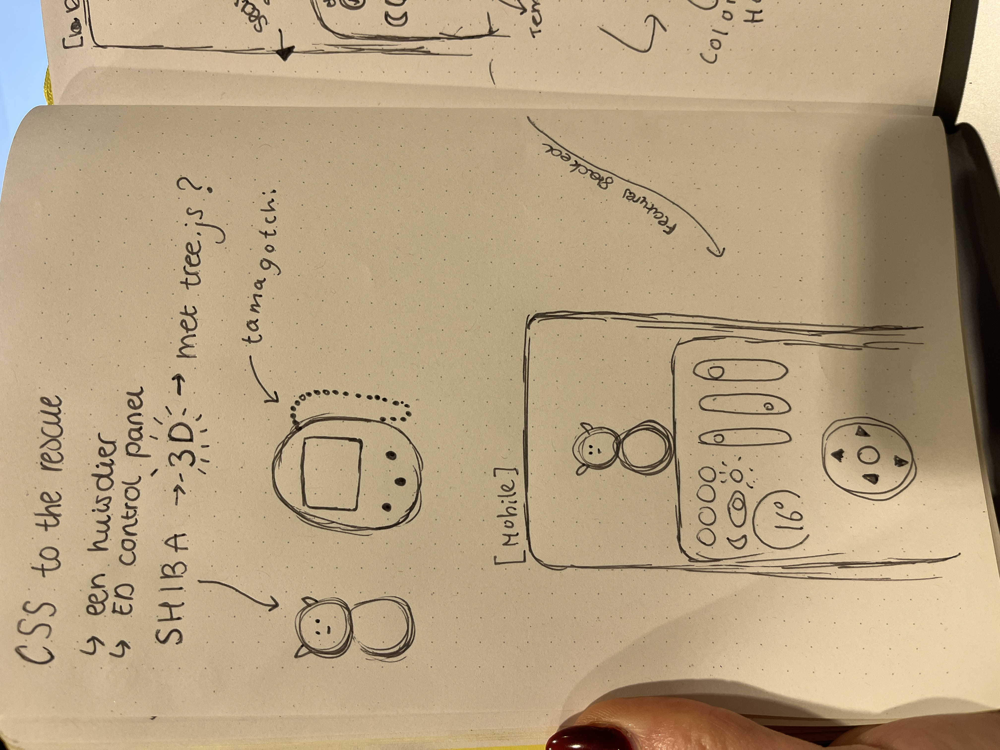
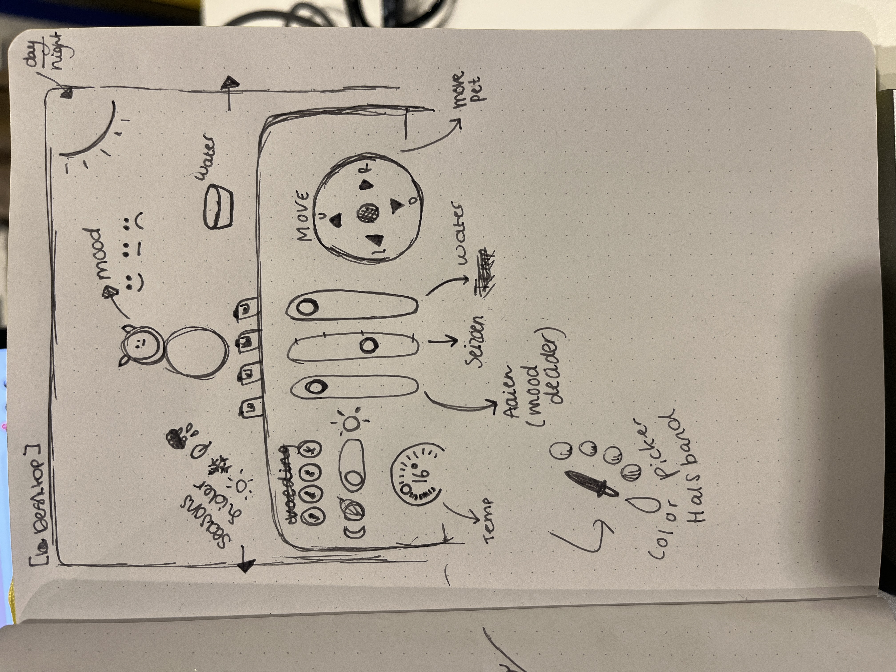

### Inspiratie 
Hier zijn een paar afbeeldingen van de stijl die ik wil gaan aanhouden.
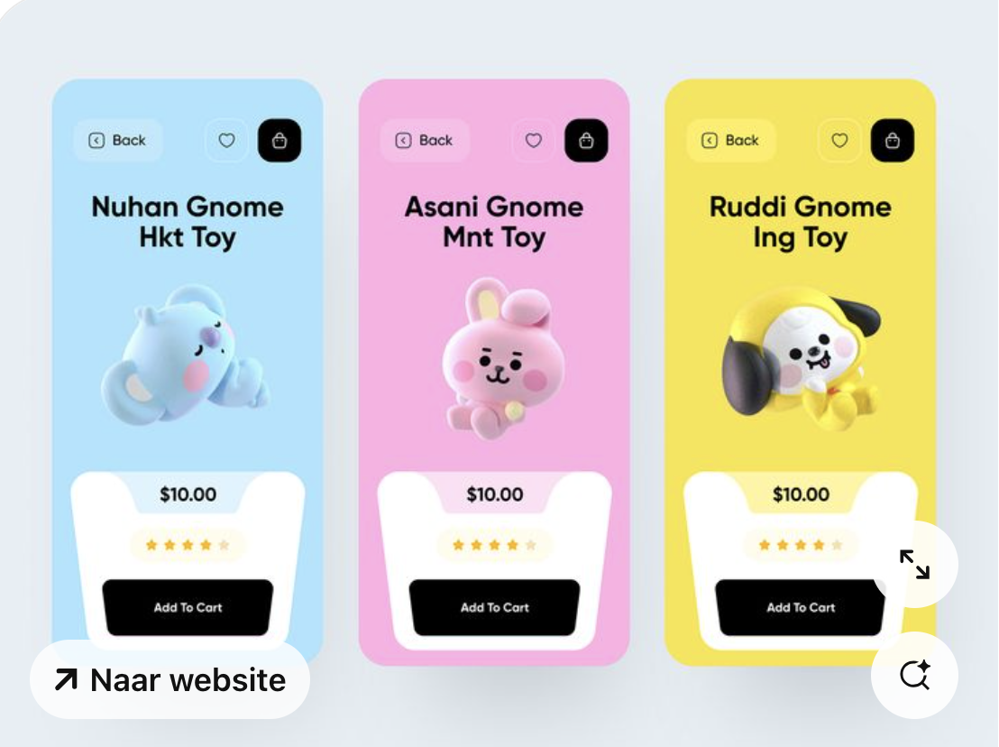
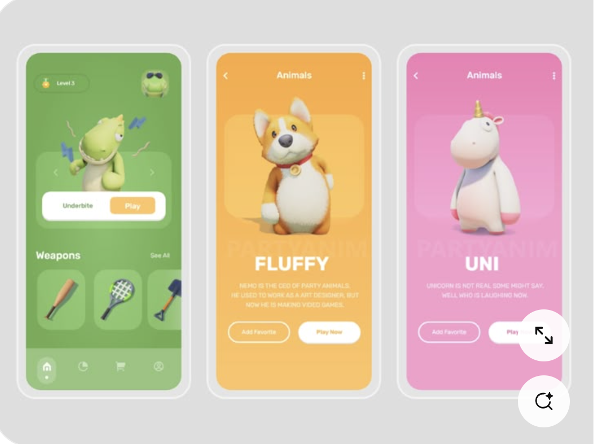
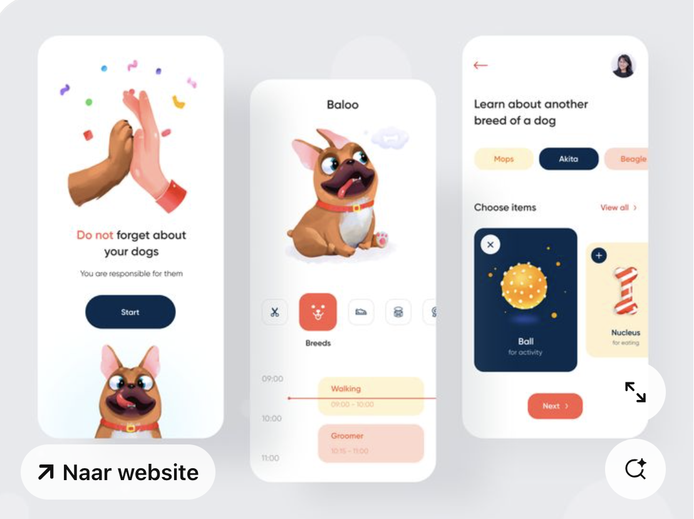
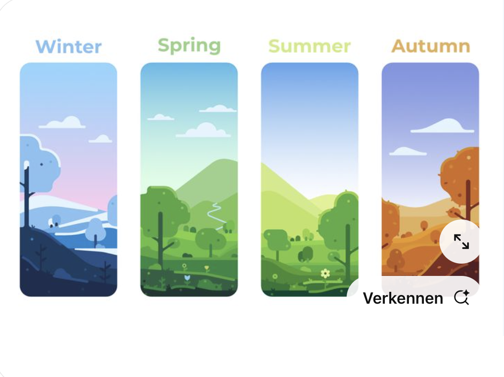
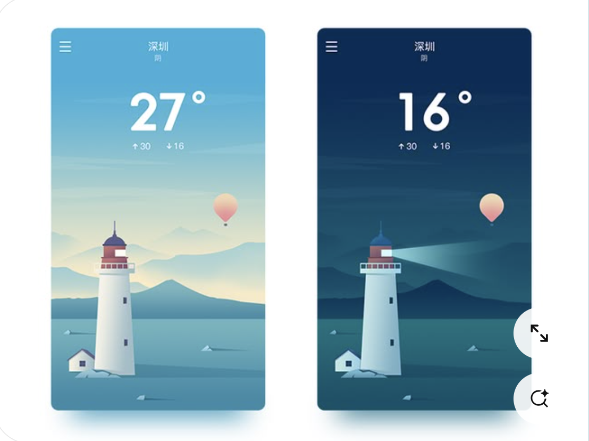

## Week 2
In week 2 heb ik de volgende workshops gevolgd: 
* :Has
* Vormen in CSS
  * Gradients
      * linear-gradient
      * radial-gradient
      * conic-gradient
  * Clip paths
  * Border-radius
* Custom properties
Ik heb hier veel notities over gemaakt in mijn boekje en toegepast op mijn eigen ontwerp.

 ### Control panel update
 Deze week ben ik begonnen met het maken van mijn CSS hondje. 
 Eerst zag mijn hondje er zo uit: 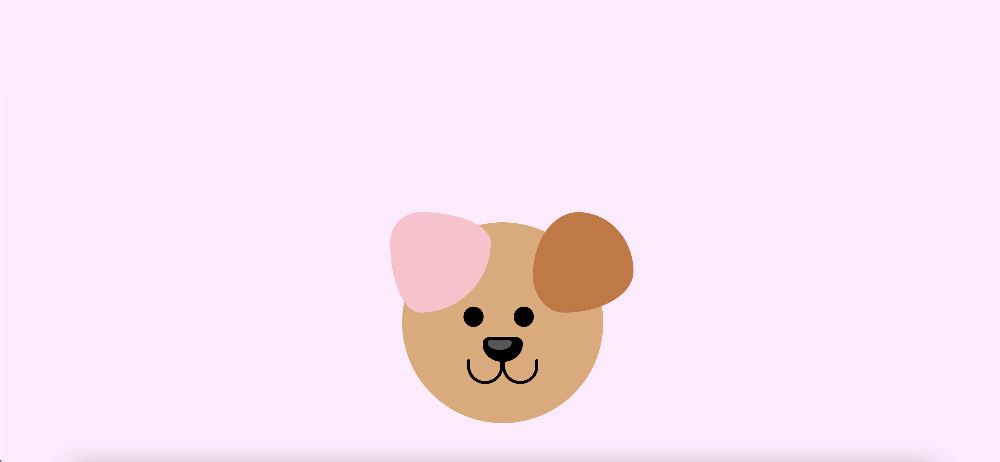 vrij simpel


Zo ziet hij er nu uit.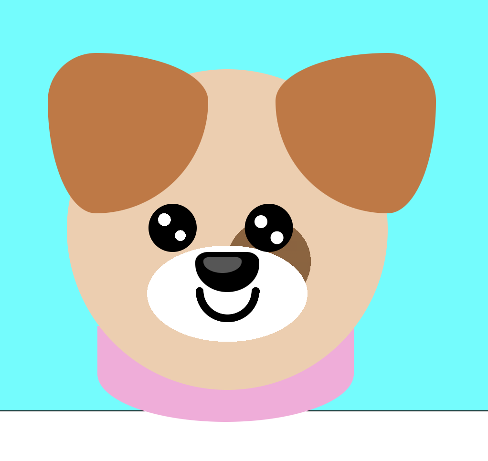 
Ik liep tegen een paar dingen aan. Het centreren van de hond. Het postioneren van alle vormen en de lagen met z-index werkende maken. Het maken van de ogen had ik eerst  met `::before` en `::after` elementen gedaan. Maar later kwam ik er achterd dat ik met radial gradients heel makkelijk circulaire vormen kan toevoegen aan het hoofd van de hond. 

## Planning week 3
Ik ben nu tevreden met hoe de hond eruit ziet en ga me nu focussen op:
* De control panel 
* Zorgen dat ik geen classes meer in mijn doc heb
* Gebruik maken van :has en :checked 
* Positioneren met grid
* Achtergrond(en) maken met CSS 
* Slim gebruik maken van custom properties
* Animeren van mijn hondje (gradients animeren) met @support


 
## Container styles workshop

```
--rood:true 
--blauw: true
```

```
@container style(--rood:true) and style(--blauw) {
  body {
    background: purple;
  }

}
```

@container (style(--rood:true) and style(--blauw)) or style (--paars:true){


}

### code experimenten
Ik ben deze week begonnen met de daadwerkelijke control panel. Ik begon met deze buttons: 

Ik vond het niet moeilijk om de buttons te stijlen, maar om ze daadwerklijk het gezicht van het hondje te laten veranderen vond ik moelijker. Ik maakte een fout met de has selector waardoor er telkens niks gebeurde.

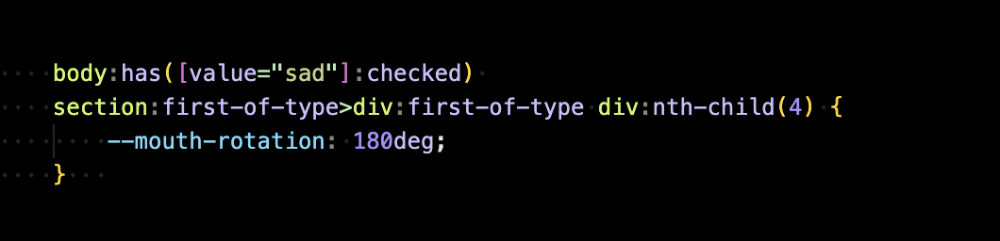 Na hulp van >> is het me gelukt om de juiste selector te vinden, want ik selecteerde telkens in een bepaalde section, waardoor die niet in de eerste section meer kon kijken. Dus heb ik de `:has` selector op de body gezet waardoor die alles kan zien.


Voor de volgende control panel item wilde ik een slider maken, die dan een bakje water vult van de hond. Ik heb aan het begin geëxperimenteerd met hbet gebruiken van een `input=range` maar ik kwam er achter dan je om de waardes te berekenen JavaScript nodig hebt. Dus ging ik opzoek naar een ander alternatief om dit op te lossen. Ik kwam uit bij [deze tutoria](https://www.thenoorhub.in/2022/01/pure-css-range-slider-pure-css-dot.html) Deze tutoral gebruikt radio buttons om de slider te maken: 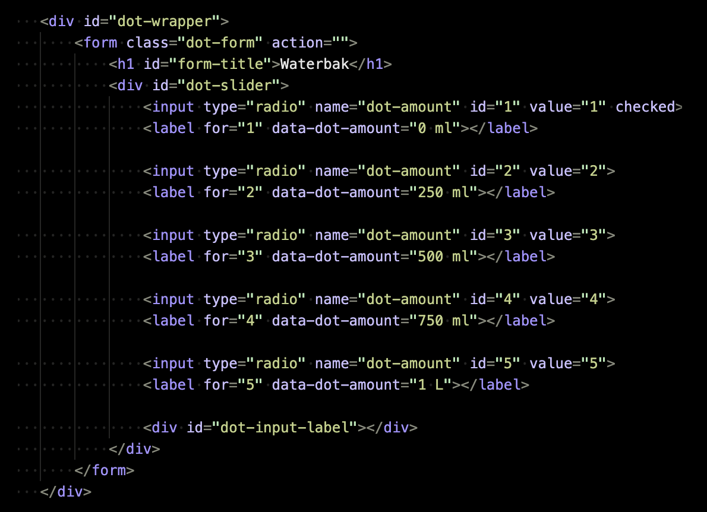. Ik heb hem op deze manier gestijld en zo ziet hij er nu uit: 
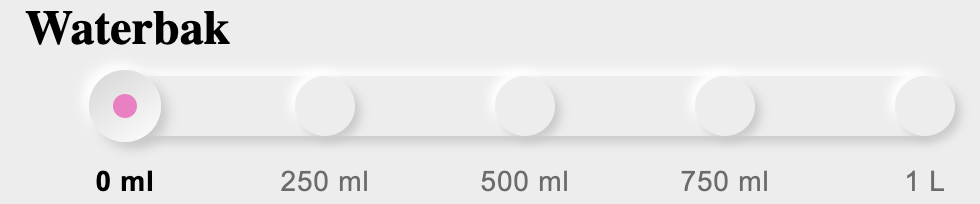


