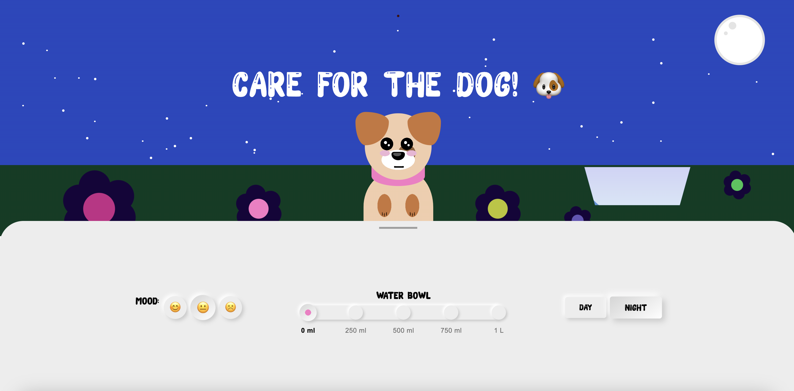

# CSS to the rescue Lisa Mandemakers
Hier hou ik mijn proces bij voor dit vak, het is de bedoeling dat ik alleen gebruik ga maken van HTML en CSS. Ik documenteer mijn CSS experimenten in deze README.


## Final assessment: Modular control panel
Ik heb gekozen voor opracht 1 > de control panel, omdat deze mij het meest aanspreekt qua uitdagingen, maar ook op het gebied van vormgeving. 


## Week 1
### Het idee
Ik wil een control panel gaan maken voor een hondje, waarin gebruikers interacties kunnen uitvoeren zoals het verzorgen, spelen en trainen van de hond. Het panel bevat sliders om de mood en de omstandigheden van de hond aan te passen.

### Schetsen 
Dit zijn mijn eerste schetsen voor het ontwerp


### Inspiratie 
Hier zijn een paar afbeeldingen van de stijl die ik wil gaan aanhouden.


## Week 2
In week 2 heb ik de volgende workshops gevolgd: 
* :Has
* Vormen in CSS
  * Gradients
      * linear-gradient
      * radial-gradient
      * conic-gradient
  * Clip paths
  * Border-radius
* Custom properties
Ik heb hier veel notities over gemaakt in mijn boekje en toegepast op mijn eigen ontwerp.

 ### Control panel update
 Deze week ben ik begonnen met het maken van mijn CSS hondje. 
 Eerst zag mijn hondje er zo uit:  vrij simpel


Zo ziet hij er nu uit. 
Ik liep tegen een paar dingen aan. Het centreren van de hond. Het postioneren van alle vormen en de lagen met z-index werkende maken. Het maken van de ogen had ik eerst  met `::before` en `::after` elementen gedaan. Maar later kwam ik er achterd dat ik met radial gradients heel makkelijk circulaire vormen kan toevoegen aan het hoofd van de hond. 

### Gradients gebruiken ipv pseudo elements 
Toen ik in week 1 begon aan mijn hond had ik de ogen op deze manier gemaakt:  op twee verschillende manieren. Ik heb nu wel geleerd hoe de `box-shadow` werkt, maar ideaal vond ik het niet om de ogen op 2 verschillende manieren te moeten maken. A.g ik er bijvoorbeeld niet makkelijk mee kan animeren. Ik koos ervoor om de ogen weg t halen en ze gewoon de maken met `radial-gradients`.  


## Week 3
Ik ben nu tevreden met hoe de hond eruit ziet en ga me nu focussen op:
* De control panel 
* Zorgen dat ik geen classes meer in mijn doc heb
* Gebruik maken van :has en :checked 
* Positioneren met grid
* Achtergrond(en) maken met CSS 
* Slim gebruik maken van custom properties
* Animeren van mijn hondje (gradients animeren) met @support


 
### Container styles workshop

```
--rood:true 
--blauw: true
```

```
@container style(--rood:true) and style(--blauw) {
  body {
    background: purple;
  }

}
```

@container (style(--rood:true) and style(--blauw)) or style (--paars:true){


}

### code experimenten
Ik ben deze week begonnen met de daadwerkelijke control panel. Ik begon met deze buttons: 

Ik vond het niet moeilijk om de buttons te stijlen, maar om ze daadwerklijk het gezicht van het hondje te laten veranderen vond ik moelijker. Ik maakte een fout met de has selector waardoor er telkens niks gebeurde.

 Na hulp van >> is het me gelukt om de juiste selector te vinden, want ik selecteerde telkens in een bepaalde section, waardoor die niet in de eerste section meer kon kijken. Dus heb ik de `:has` selector op de body gezet waardoor die alles kan zien.


Voor de volgende control panel item wilde ik een slider maken, die dan een bakje water vult van de hond. Ik heb aan het begin geëxperimenteerd met hbet gebruiken van een `input=range` maar ik kwam er achter dan je om de waardes te berekenen JavaScript nodig hebt. Dus ging ik opzoek naar een ander alternatief om dit op te lossen. Ik kwam uit bij [deze tutorial](https://www.thenoorhub.in/2022/01/pure-css-range-slider-pure-css-dot.html) gebruikt radio buttons om de slider te maken: . Ik heb hem op deze manier gestijld en zo ziet hij er nu uit: 


### Werken zonder classes 
Ik merk dat het me wel goed afgaat om zonder classes te werken. het enige wat ik irritant vind is de `nth-of-...` selector, omdat ik dan niet zomaar een `<div></div>` of iets anders kan toevoegen omdat dat dan de hele volgorde aanpas

## Week 4

### CSS Style containers
Deze week ben ik begonnen met gebruiken van style containers, voor de "day en night" modus. Hier heb ik de volgende code voor geschreven:

 hier zie je dat wanneer er op de value van "day" wordt geklikt er een custom property "true" wordt en wanneer dat gebeurd wordt de volgende style query aangeroepen:  

Ik vind dit een fijne manier van werken omdat je gelijk allemaal HTML lementen kan aanspreken terwijl je maar 1 button checked. 

### CSS Container queries
Ik kwam er na een tijd niet uit hoe ik de hond goed kon laten meeschalen met het beeld. Ik had op elk onderdeel van de hond de `vw` unity gebruik, wat betekent dat de hond meeschaalde op basis van de breedte van het scherm. Dit wilde ik niet want dat werd de hond veel te groot. 

Ik wilde dat hij zich zou aanpassen aan de parent container dus heb ik de `cqw` unit gebruikt. 

Ik moest alles weer helemaal opnieuw omrekenen hiermee (alles moest 2.5x vergoot) en toen werd het hondje eindelijk mooi geschaald als hoe ik het wilde.

### CSS nesting
Tijdens dit project heb ik kennis gemaakt met nesting in css. Ik vind ook dit een hele fijne en efficiente manier van werke, omdat het je regels code bespaard en alles fijn bij elkaar hebt staan.


Zo heb ik hier allemaal verschillende keertjes en maten kunnen toevoegen door te nesten. Ook heb ik alle `::before` en `::after` elementen genest.

### Animating gradients
Ik wilde heel graag leren hoe je gradients kon animeren. Ik kon me nog iets herrinneren van de workshop van sanne met `@support`, maar ik kon niet meer zelf in stand brengen hoe het nou precies werkte. Ik vroeg eerst om hulp aan chat GPT, maar die gaf me oplossingen die niet werkte. Chat zei namelijk dit:
 
Dit werkte niet en dus vroeg ik om hulp aan Nils, de docent. Hij gaf me een veel betere oplossing met custom properties: 
 
Hier zie je dat op de de plek van het aantal procent van de grootte van het ook nu een custom properthy staat met: `var(--eye-size)` die ik heb gedefineerd op deze manier: 

```
 @property --eye-size {
    syntax: '<percentage>';
    inherits: true;
    initial-value: 9%;
} 
```
Op deze manier kan ik gewoon animeren met de groottes van de gradients!

## Resultaten
Ik ben er blij met het eind resultaat. Ik had niet gedacht 4 weken geleden dat ik dit had kunnen neerzetten. k ben vooral trots op het werken met custom properties in CSS. Het maakte het veel makkelijker om kleuren en stijlen consistent toe te passen en tegelijkertijd flexibel te blijven in het aanpassen van het ontwerp.

Het gebruik van media queries was een ander belangrijk aspect. Door mijn ontwerp responsive te maken, kon ik ervoor zorgen dat de pagina op verschillende schermformaten goed werkte, wat het gebruikersgemak alleen maar verbeterde.

 
 


## Herkansing

Voor de herkansing heb ik feedback ontvangen en gericht gewerkt aan een aantal punten om mijn project te verbeteren. Hieronder een overzicht van de onderdelen die ik heb aangepast en een korte toelichting per punt.

* Correct responsiveness
* Gebruik van vh = 100 en overflow: hidden
* Positionering van top en bottom elementen
* Opruimen van dubbele en overbodige CSS-code
* Positionering van het control panel
* Gebruik van aparte CSS-documenten
* main van voorgrond gehaald
* Soepelere animaties
* h1 laten schalen op mobiel
* Waterbak correct gepositioneerd

### Correct responsiveness
Wat was het probleem: De layout schaalt niet goed mee op alle schermformaten, met name mobiel.
Aanpassing: Ik heb units als vh herzien en gebruik gemaakt van cqh, cqw om responsieve groottes in te stellen. Ik heb complexe code met mediaqueries ook weg gehaald en bijvoorbeel een flexbox voor in de plaats gezet. 

### Gebruik van vh = 100 en overflow: hidden
Wat was het probleem: Ik heb een uitschuif knop en je kon gewoon naar beneden scrollen om die knop te zien, dat is uiteraard niet de bedoeling.
Aanpassing: Ik heb gebruik gemaakt van height: 100vh en daarna overflow: hidden gebruikt, zodat na 100vh (hele scherm lengte), je niet meer kon scrollen en dus de knop zou zien.

### Positionering van top en bottom elementen
Wat was het probleem: Ik maakte geen goed gebruik van `top` en `bottom`
Aanpassing: IK wist niet dat het soms beter is om `top` te gebruiken en soms beter is om `bottom` (geld ook voor `left` en `right`). 
Maar daar heb ik nu aan gewerkt en nu bijv bij het hondje, de aan het gras moet blijven heb ik `bottom` gebruikt. Wat veel mooier werkt.

### Dubbele en overbodige CSS-code opgeschoond
Wat was het probleem: Er stond code inh het project wat dubbel was geschreven en eigenlijk compleet overbodig was.
Aanpassing: Ik heb alle CSS opgeschoond. Ongebruikte selectors en dubbele definities zijn verwijderd. Dit maakt de code overzichtelijker. Ook heb ik meer dingen genest.

### Positionering control panel verbeterd
Wat was het probleem: Het control panel inhoud verschoof op bepaalde schermgroottes of stond niet op een logische plek.
Aanpassing: Ik heb de positionering van het panel veranderd met behulp van flexbox, zodat het netjes gecentreerd staat en flexibel blijft.

### Aparte CSS-documenten
Wat was het probleem: Alles stond in één bestand, wat het onoverzichtelijk maakte.
Aanpassing: Ik heb de CSS opgesplitst in meerdere logische modules, zoals dog.css, controlpanel.css, variables.css, enzovoort. Dit maakt het onderhoud eenvoudiger.

### Voorgrond-elementen gecorrigeerd (main van voorgrond gehaald)
Wat was het probleem: De main stond visueel op de voorgrond terwijl het niet de bedoeling was.
Aanpassing: De z-index-waarden veranderd, zodat de juiste elementen vooraan staan.

### Soepelere animaties
Wat was het probleem: Sommige animaties waren abrupt of niet vloeiend.
Aanpassing: Ik heb gebruik gemaakt van custom properties, waarvan ik de waarde aanpas zodra er iets moest gebeuren.

```css
body:has(input[value="change-height"]:checked) {
    --heightbackground: 60vh;
    --dog-position:10%;
    --dog-scale: 0.7;
    --control-panel-opacity: 1;
    --h1-position: 3em;
    --h1-font-size: 1.2em;
}
```

Hier zie je dat ik bijvoorbeeld de hond kleiner laat worden met scaling, zodra het conrtol panel omhoog verschuift. Ik heb op de elementen over een `transition: 1s ease-in-out;` geplaatst, zodat het in een mooie vloeiende beweging gebeurd.

### h1 mooi schalend op mobiel
Wat was het probleem: De h1-titel was te groot op mobiel scherm. Alleen wanneer de controlpanel omhoog werd geschakeld.
Aanpassing: De `font-size` van de h1 een custom property meegeven en deze vervolgens aanpassen zodra de control panel omhoog wordt geklikt.

### Waterbak correct gepositioneerd
Wat was het probleem: De visuele waterbak versprong of stond niet logisch ten opzichte van het hondje.
Aanpassing: De positionering is verbeterd met relative containers en absolute plaatsing binnen context, zodat het watebakje goed staat in verhouding met de hond.


## Bronnenlijst

* [Dog inspo](https://www.youtube.com/watch?v=XN3KWtbVYug&t=1557s)
* [Dot slider](https://www.thenoorhub.in/2022/01/pure-css-range-slider-pure-css-dot.html)
* [Wave animation](https://codepen.io/rstacruz/pen/oxJqNv)
* [Zon en maan](https://codepen.io/gvissing/pen/XWVpjJd)
* [Workshop met Sanne voor style queries](https://codepen.io/shooft/pen/OJGNKJz*/)
* [Range sliders]( https://www.smashingmagazine.com/2021/12/create-custom-range-input-consistent-browsers/ )


